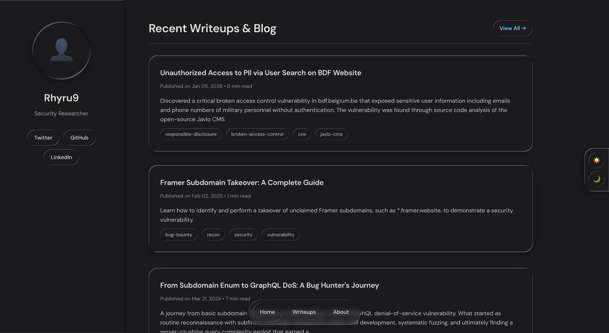
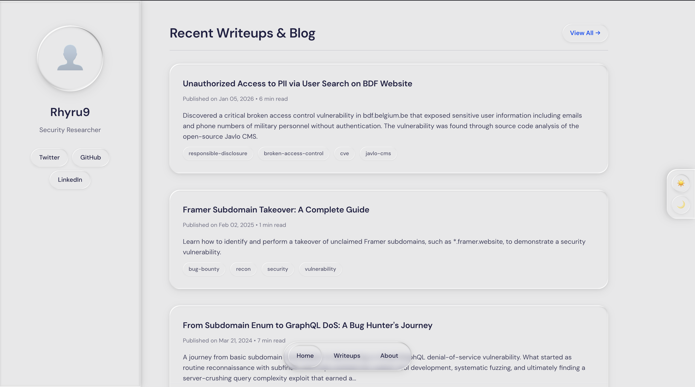

# Personal Website

A modern personal portfolio website built with Jekyll, focused on security research and writeups.

## Preview

### Dark Mode


### Light Mode


## Project Structure

```
.
├── _config.yml              # Site configuration
├── _data/
│   ├── certificates.yml     # Certificates data
│   ├── hall_of_fame.yml     # Hall of Fame entries
│   └── profile.yml          # Profile information
├── _includes/
│   ├── head.html           # HTML head section
│   ├── sidebar.html        # Navigation sidebar
│   ├── theme-switcher.html # Dark/Light mode toggle
│   └── writeup-card.html   # Blog post card component
├── _layouts/
│   ├── default.html        # Base layout
│   ├── page.html           # Page layout
│   └── post.html           # Blog post layout
├── _posts/                 # Blog posts/writeups
├── about/                  # About page
├── assets/
│   ├── css/               # Stylesheets
│   ├── images/            # Images and favicons
│   └── js/                # JavaScript files
├── blog/                  # Blog listing page
├── certificates/          # Certificates page
├── hall-of-fame/         # Hall of Fame page
└── index.html            # Homepage
```

## Usage

### Creating a New Post

Create a new markdown file in `_posts/`:

```markdown
---
layout: post
title: "Your Post Title"
date: 2024-01-08
categories: [xss, bug-bounty]
---

Your content here...
```

### Adding Certificates

Edit `_data/certificates.yml`:

```yaml
- name: "Certificate Name"
  issuer: "Issuing Organization"
  date: "2024-01-08"
  image: "/assets/images/cert.png"
  url: "https://credential-url.com"
```

### Adding Hall of Fame Entries

Edit `_data/hall_of_fame.yml`:

```yaml
- company: "Company Name"
  date: "2024-01-08"
  severity: "Critical"
  description: "Brief description"
  url: "https://company.com/security"
```

### Updating Profile

Edit `_data/profile.yml`:

```yaml
name: "Your Name"
bio: "Your bio here"
email: "your.email@example.com"
github: "yourusername"
linkedin: "yourprofile"
```

## Customization

Edit `_config.yml` for site settings:

```yaml
title: Your Name
description: Security Researcher
url: "https://yourusername.github.io"
```

Customize styles in `assets/css/` directory.

## License

MIT License

## Contact

- Email: Reyhansyah4@gmail.com
- LinkedIn: [linkedin.com](https://www.linkedin.com/in/rhyru-2714a5277/)
- GitHub: github.com/rhyru9

---

Made with ❤️ by Rhyru9